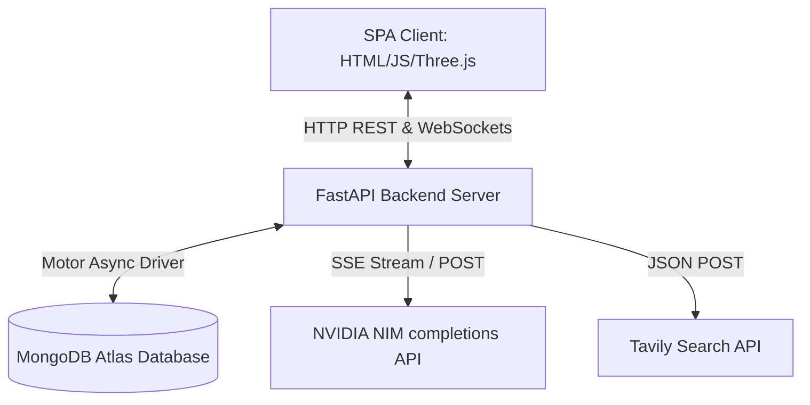
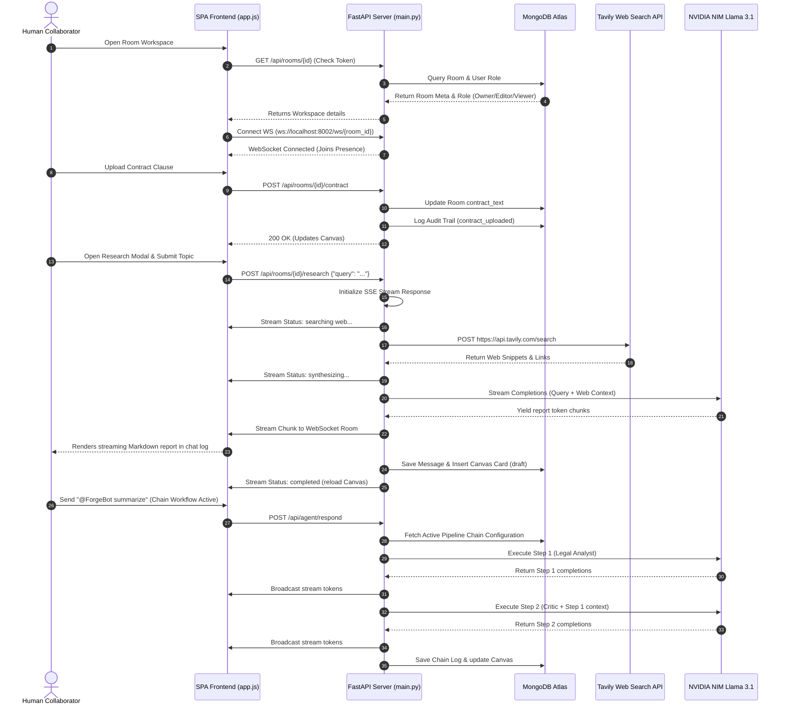
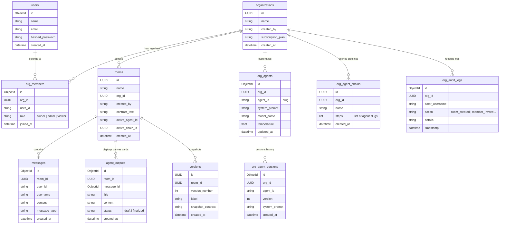

# System Architecture & Flow

This document details the system design, communication protocols, and data models of **ForgeRoom**.

---

## 🏗️ 1. High-Level Architecture Topology

ForgeRoom uses a decoupled architecture. The frontend is a SPA client, and the backend is a Python FastAPI service. MongoDB Atlas acts as the shared persistence layer.

---

## 🔄 2. End-to-End Core Flow Diagram

Here is a visual map of the operational workflow when a user enters the workspace, uploads a document, triggers a research query, and processes cascaded AI pipelines.

---

## 💾 3. Database Data Schema & Relationships

Below is the entity relationship layout representing MongoDB Atlas collections and references:

---

## 🔒 4. Role-Based Access Control (RBAC) Permissions Matrix

The backend enforces strict validation gates during REST calls and WebSocket frames based on membership mapping:

| Endpoint Area | Required Roles (Org Scope) | Action Result |
| :--- | :--- | :--- |
| **`POST /rooms`** | Owner, Editor | Success (Creates room scoped to active organization) |
| **`POST /rooms/{id}/contract`** | Owner, Editor | Success (Updates document context) |
| **`POST /rooms/{id}/snapshots`** | Owner, Editor | Success (Freezes current version) |
| **`POST /rooms/{id}/branch`** | Owner, Editor | Success (Spins up clone workspace) |
| **`POST /rooms/{id}/research`** | Owner, Editor | Success (Launches Tavily live crawler) |
| **`PATCH /orgs/{id}/agents/{agent_id}`** | Owner | Success (Edits AI instructions / prompts) |
| **`POST /orgs/{id}/agents/{agent_id}/revert`**| Owner | Success (Rolls back AI prompt version) |
| **`POST /orgs/{id}/chains`** | Owner | Success (Builds sequential multi-agent cascades) |
| **Viewer Operations (All)** | Viewer | **Blocked (`403 Forbidden` / Websocket Error Alert)** |
